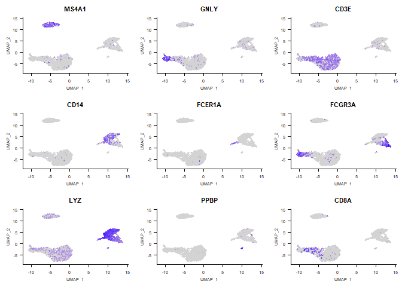
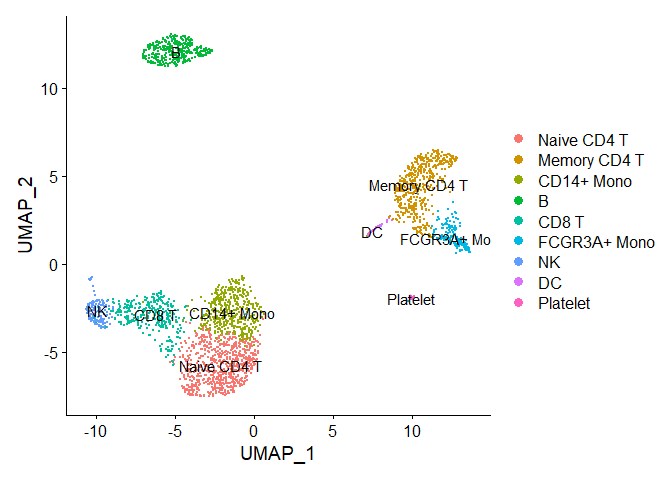

``` r
library(dplyr)
```

    ## 
    ## Attaching package: 'dplyr'

    ## The following objects are masked from 'package:stats':
    ## 
    ##     filter, lag

    ## The following objects are masked from 'package:base':
    ## 
    ##     intersect, setdiff, setequal, union

``` r
library(Seurat)
```

    ## Attaching SeuratObject

``` r
library(patchwork)
```

# Download the rawdata here:

<https://s3-us-west-2.amazonaws.com/10x.files/samples/cell/pbmc3k/pbmc3k_filtered_gene_bc_matrices>.


    ```r
    # Load the PBMC dataset
    pbmc.data <- Read10X(data.dir = "./pbmc3k_filtered_gene_bc_matrices/filtered_gene_bc_matrices/hg19")
    # Initialize the Seurat object with the raw (non-normalized data).

    pbmc <- CreateSeuratObject(counts = pbmc.data, project = "pbmc3k", min.cells = 3, min.features = 200)

    ## Warning: Feature names cannot have underscores ('_'), replacing with dashes
    ## ('-')

``` r
pbmc
```

    ## An object of class Seurat 
    ## 13714 features across 2700 samples within 1 assay 
    ## Active assay: RNA (13714 features, 0 variable features)

``` r
# The [[ operator can add columns to object metadata. This is a great place to stash QC stats
pbmc[["percent.mt"]] <- PercentageFeatureSet(pbmc, pattern = "^MT-")

# Visualize QC metrics as a violin plot
VlnPlot(pbmc, features = c("nFeature_RNA", "nCount_RNA", "percent.mt"), ncol = 3)
```

<!-- -->

``` r
# FeatureScatter is typically used to visualize feature-feature relationships, but can be used
# for anything calculated by the object, i.e. columns in object metadata, PC scores etc.

plot1 <- FeatureScatter(pbmc, feature1 = "nCount_RNA", feature2 = "percent.mt")
plot2 <- FeatureScatter(pbmc, feature1 = "nCount_RNA", feature2 = "nFeature_RNA")
plot1 + plot2
```

<!-- -->

``` r
pbmc <- NormalizeData(pbmc, normalization.method = "LogNormalize", scale.factor = 10000)

pbmc <- FindVariableFeatures(pbmc, selection.method = "vst", nfeatures = 2000)
```

``` r
# Identify the 10 most highly variable genes
top10 <- head(VariableFeatures(pbmc), 10)
top10
```

    ##  [1] "PPBP"   "S100A9" "IGLL5"  "LYZ"    "GNLY"   "FTL"    "PF4"    "FTH1"  
    ##  [9] "FCER1A" "GNG11"

``` r
# plot variable features with and without labels
plot1 <- VariableFeaturePlot(pbmc)
plot2 <- LabelPoints(plot = plot1, points = top10, repel = TRUE)
```

    ## When using repel, set xnudge and ynudge to 0 for optimal results

``` r
plot1 + plot2
```

<!-- -->

``` r
all.genes <- rownames(pbmc)
pbmc <- ScaleData(pbmc, features = all.genes)
```

    ## Centering and scaling data matrix

``` r
pbmc <- RunPCA(pbmc, features = VariableFeatures(object = pbmc))
```

    ## PC_ 1 
    ## Positive:  MALAT1, LTB, IL32, CD2, ACAP1, STK17A, CTSW, CD247, CCL5, GIMAP5 
    ##     AQP3, GZMA, CST7, TRAF3IP3, MAL, HOPX, ITM2A, GZMK, MYC, BEX2 
    ##     GIMAP7, ETS1, LDLRAP1, ZAP70, LYAR, RIC3, TNFAIP8, KLRG1, SAMD3, NKG7 
    ## Negative:  CST3, TYROBP, LST1, AIF1, FTL, FCN1, LYZ, FTH1, S100A9, FCER1G 
    ##     TYMP, CFD, LGALS1, CTSS, S100A8, SERPINA1, LGALS2, SPI1, IFITM3, PSAP 
    ##     CFP, SAT1, IFI30, COTL1, S100A11, NPC2, LGALS3, GSTP1, PYCARD, NCF2 
    ## PC_ 2 
    ## Positive:  CD79A, MS4A1, TCL1A, HLA-DQA1, HLA-DRA, HLA-DQB1, LINC00926, CD79B, HLA-DRB1, CD74 
    ##     HLA-DPB1, HLA-DMA, HLA-DQA2, HLA-DRB5, HLA-DPA1, HLA-DMB, FCRLA, HVCN1, LTB, BLNK 
    ##     KIAA0125, P2RX5, IRF8, IGLL5, SWAP70, ARHGAP24, SMIM14, PPP1R14A, FCRL2, C16orf74 
    ## Negative:  NKG7, PRF1, CST7, GZMA, GZMB, FGFBP2, CTSW, GNLY, GZMH, SPON2 
    ##     CCL4, FCGR3A, CCL5, CD247, XCL2, CLIC3, AKR1C3, SRGN, HOPX, CTSC 
    ##     TTC38, S100A4, ANXA1, IL32, IGFBP7, ID2, ACTB, XCL1, APOBEC3G, SAMD3 
    ## PC_ 3 
    ## Positive:  HLA-DQA1, CD79A, CD79B, HLA-DQB1, HLA-DPB1, CD74, HLA-DPA1, MS4A1, HLA-DRB1, HLA-DRB5 
    ##     HLA-DRA, HLA-DQA2, TCL1A, LINC00926, HLA-DMB, HLA-DMA, HVCN1, FCRLA, IRF8, BLNK 
    ##     KIAA0125, SMIM14, PLD4, IGLL5, P2RX5, TMSB10, SWAP70, LAT2, MALAT1, IGJ 
    ## Negative:  PPBP, PF4, SDPR, SPARC, GNG11, NRGN, GP9, RGS18, TUBB1, CLU 
    ##     HIST1H2AC, AP001189.4, ITGA2B, CD9, TMEM40, CA2, PTCRA, ACRBP, MMD, TREML1 
    ##     NGFRAP1, F13A1, RUFY1, SEPT5, MPP1, CMTM5, TSC22D1, MYL9, RP11-367G6.3, GP1BA 
    ## PC_ 4 
    ## Positive:  HLA-DQA1, CD79A, CD79B, HIST1H2AC, HLA-DQB1, PF4, MS4A1, SDPR, CD74, PPBP 
    ##     HLA-DPB1, GNG11, HLA-DQA2, SPARC, HLA-DRB1, HLA-DPA1, GP9, TCL1A, HLA-DRA, LINC00926 
    ##     NRGN, RGS18, HLA-DRB5, PTCRA, CD9, AP001189.4, CA2, CLU, TUBB1, ITGA2B 
    ## Negative:  VIM, S100A8, S100A6, S100A4, S100A9, TMSB10, IL32, GIMAP7, LGALS2, S100A10 
    ##     RBP7, FCN1, MAL, LYZ, S100A12, MS4A6A, CD2, FYB, S100A11, FOLR3 
    ##     GIMAP4, AQP3, ANXA1, AIF1, MALAT1, GIMAP5, IL8, IFI6, TRABD2A, TMSB4X 
    ## PC_ 5 
    ## Positive:  GZMB, FGFBP2, NKG7, GNLY, PRF1, CCL4, CST7, SPON2, GZMA, CLIC3 
    ##     GZMH, XCL2, CTSW, TTC38, AKR1C3, CCL5, IGFBP7, XCL1, CCL3, S100A8 
    ##     TYROBP, HOPX, CD160, HAVCR2, S100A9, FCER1G, PTGDR, LGALS2, RBP7, S100A12 
    ## Negative:  LTB, VIM, AQP3, PPA1, MAL, KIAA0101, CD2, CYTIP, CORO1B, FYB 
    ##     IL32, TRADD, ANXA5, TUBA1B, HN1, TYMS, PTGES3, ITM2A, COTL1, GPR183 
    ##     TNFAIP8, ACTG1, TRAF3IP3, ATP5C1, GIMAP4, ZWINT, PRDX1, LDLRAP1, ABRACL, NGFRAP1

``` r
# Examine and visualize PCA results a few different ways
print(pbmc[["pca"]], dims = 1:5, nfeatures = 5)
```

    ## PC_ 1 
    ## Positive:  MALAT1, LTB, IL32, CD2, ACAP1 
    ## Negative:  CST3, TYROBP, LST1, AIF1, FTL 
    ## PC_ 2 
    ## Positive:  CD79A, MS4A1, TCL1A, HLA-DQA1, HLA-DRA 
    ## Negative:  NKG7, PRF1, CST7, GZMA, GZMB 
    ## PC_ 3 
    ## Positive:  HLA-DQA1, CD79A, CD79B, HLA-DQB1, HLA-DPB1 
    ## Negative:  PPBP, PF4, SDPR, SPARC, GNG11 
    ## PC_ 4 
    ## Positive:  HLA-DQA1, CD79A, CD79B, HIST1H2AC, HLA-DQB1 
    ## Negative:  VIM, S100A8, S100A6, S100A4, S100A9 
    ## PC_ 5 
    ## Positive:  GZMB, FGFBP2, NKG7, GNLY, PRF1 
    ## Negative:  LTB, VIM, AQP3, PPA1, MAL

``` r
VizDimLoadings(pbmc, dims = 1:2, reduction = "pca")
```

<!-- -->

``` r
DimPlot(pbmc, reduction = "pca")
```

<!-- -->

``` r
DimHeatmap(pbmc, dims = 1, cells = 500, balanced = TRUE)
```

<!-- -->

``` r
# NOTE: This process can take a long time for big datasets, comment out for expediency. More
# approximate techniques such as those implemented in ElbowPlot() can be used to reduce
# computation time
pbmc <- JackStraw(pbmc, num.replicate = 100)
pbmc <- ScoreJackStraw(pbmc, dims = 1:20)

JackStrawPlot(pbmc, dims = 1:15)
```

    ## Warning: Removed 23300 rows containing missing values (geom_point).

<!-- -->

``` r
ElbowPlot(pbmc)
```

<!-- -->

``` r
pbmc <- FindNeighbors(pbmc, dims = 1:10)
```

    ## Computing nearest neighbor graph

    ## Computing SNN

``` r
pbmc <- FindClusters(pbmc, resolution = 0.5)
```

    ## Modularity Optimizer version 1.3.0 by Ludo Waltman and Nees Jan van Eck
    ## 
    ## Number of nodes: 2700
    ## Number of edges: 97892
    ## 
    ## Running Louvain algorithm...
    ## Maximum modularity in 10 random starts: 0.8719
    ## Number of communities: 9
    ## Elapsed time: 0 seconds

``` r
# Look at cluster IDs of the first 5 cells
head(Idents(pbmc), 5)
```

    ## AAACATACAACCAC-1 AAACATTGAGCTAC-1 AAACATTGATCAGC-1 AAACCGTGCTTCCG-1 
    ##                0                3                2                5 
    ## AAACCGTGTATGCG-1 
    ##                6 
    ## Levels: 0 1 2 3 4 5 6 7 8

``` r
pbmc <- RunUMAP(pbmc, dims = 1:10)
```

    ## Warning: The default method for RunUMAP has changed from calling Python UMAP via reticulate to the R-native UWOT using the cosine metric
    ## To use Python UMAP via reticulate, set umap.method to 'umap-learn' and metric to 'correlation'
    ## This message will be shown once per session

    ## 20:24:27 UMAP embedding parameters a = 0.9922 b = 1.112

    ## 20:24:27 Read 2700 rows and found 10 numeric columns

    ## 20:24:27 Using Annoy for neighbor search, n_neighbors = 30

    ## 20:24:27 Building Annoy index with metric = cosine, n_trees = 50

    ## 0%   10   20   30   40   50   60   70   80   90   100%

    ## [----|----|----|----|----|----|----|----|----|----|

    ## **************************************************|
    ## 20:24:28 Writing NN index file to temp file C:\Users\harpa\AppData\Local\Temp\Rtmp6XXANB\filea5c3a8870f5
    ## 20:24:28 Searching Annoy index using 1 thread, search_k = 3000
    ## 20:24:29 Annoy recall = 100%
    ## 20:24:29 Commencing smooth kNN distance calibration using 1 thread
    ## 20:24:30 Initializing from normalized Laplacian + noise
    ## 20:24:30 Commencing optimization for 500 epochs, with 107868 positive edges
    ## 20:24:40 Optimization finished

``` r
DimPlot(pbmc, reduction = "umap")
```

<!-- -->

``` r
# find all markers of cluster 1
cluster1.markers <- FindMarkers(pbmc, ident.1 = 1, min.pct = 0.25)

head(cluster1.markers, n = 5)
```

    ##                p_val avg_log2FC pct.1 pct.2     p_val_adj
    ## S100A9  0.000000e+00   5.504171 0.994 0.215  0.000000e+00
    ## S100A8  0.000000e+00   5.466239 0.967 0.121  0.000000e+00
    ## FCN1    0.000000e+00   3.432922 0.953 0.147  0.000000e+00
    ## LGALS2  0.000000e+00   3.717131 0.900 0.059  0.000000e+00
    ## CD14   4.401366e-294   2.805663 0.660 0.029 6.036033e-290

``` r
# find all markers of cluster 2
cluster2.markers <- FindMarkers(pbmc, ident.1 = 2, min.pct = 0.25)
head(cluster2.markers, n = 5)
```

    ##             p_val avg_log2FC pct.1 pct.2    p_val_adj
    ## LTB  1.612441e-82   1.184609 0.983 0.642 2.211301e-78
    ## IL32 1.159398e-77   1.041183 0.944 0.472 1.589998e-73
    ## LDHB 3.451452e-74   1.015630 0.972 0.607 4.733321e-70
    ## CD3D 1.368338e-65   0.882007 0.914 0.438 1.876539e-61
    ## IL7R 5.971448e-58   1.098859 0.732 0.333 8.189244e-54

``` r
# find all markers distinguishing cluster 5 from clusters 0 and 3
cluster5.markers <- FindMarkers(pbmc, ident.1 = 5, ident.2 = c(0, 3), min.pct = 0.25)
head(cluster5.markers, n = 5)
```

    ##                       p_val avg_log2FC pct.1 pct.2     p_val_adj
    ## FCGR3A        1.448731e-208   4.295367 0.975 0.037 1.986790e-204
    ## CFD           2.362385e-199   3.478465 0.937 0.033 3.239775e-195
    ## IFITM3        4.090907e-199   3.886400 0.975 0.045 5.610270e-195
    ## RP11-290F20.3 1.025050e-189   2.741460 0.849 0.017 1.405753e-185
    ## CD68          4.386481e-188   2.998564 0.906 0.033 6.015620e-184

``` r
# find markers for every cluster compared to all remaining cells, report only the positive ones
pbmc.markers <- FindAllMarkers(pbmc, only.pos = TRUE, min.pct = 0.25, logfc.threshold = 0.25)
```

    ## Calculating cluster 0

    ## Calculating cluster 1

    ## Calculating cluster 2

    ## Calculating cluster 3

    ## Calculating cluster 4

    ## Calculating cluster 5

    ## Calculating cluster 6

    ## Calculating cluster 7

    ## Calculating cluster 8

``` r
pbmc.markers %>% group_by(cluster) %>% top_n(n = 2, wt = avg_log2FC)
```

    ## Registered S3 method overwritten by 'cli':
    ##   method     from         
    ##   print.boxx spatstat.geom

    ## # A tibble: 18 x 7
    ## # Groups:   cluster [9]
    ##        p_val avg_log2FC pct.1 pct.2 p_val_adj cluster gene     
    ##        <dbl>      <dbl> <dbl> <dbl>     <dbl> <fct>   <chr>    
    ##  1 1.10e- 81       1.33 0.432 0.111 1.51e- 77 0       CCR7     
    ##  2 2.53e- 48       1.08 0.336 0.108 3.46e- 44 0       PRKCQ-AS1
    ##  3 0               5.50 0.994 0.215 0         1       S100A9   
    ##  4 0               5.47 0.967 0.121 0         1       S100A8   
    ##  5 1.61e- 82       1.18 0.983 0.642 2.21e- 78 2       LTB      
    ##  6 4.78e- 57       1.22 0.42  0.113 6.56e- 53 2       AQP3     
    ##  7 0               4.29 0.934 0.043 0         3       CD79A    
    ##  8 8.49e-274       3.58 0.619 0.022 1.16e-269 3       TCL1A    
    ##  9 1.52e-211       3.06 0.95  0.229 2.08e-207 4       CCL5     
    ## 10 4.29e-201       3.20 0.599 0.049 5.88e-197 4       GZMK     
    ## 11 5.51e-184       3.34 0.975 0.135 7.56e-180 5       FCGR3A   
    ## 12 3.17e-124       3.01 1     0.315 4.35e-120 5       LST1     
    ## 13 1.09e-259       4.81 0.966 0.072 1.49e-255 6       GZMB     
    ## 14 1.51e-170       4.82 0.939 0.135 2.07e-166 6       GNLY     
    ## 15 1.43e-267       3.87 0.833 0.009 1.96e-263 7       FCER1A   
    ## 16 3.90e- 33       2.91 0.944 0.207 5.34e- 29 7       HLA-DQA1 
    ## 17 6.19e-182       7.13 0.933 0.011 8.49e-178 8       PF4      
    ## 18 4.24e-116       8.47 1     0.024 5.81e-112 8       PPBP

``` r
VlnPlot(pbmc, features = c("CD79A", "TCL1A"))
```

<!-- -->

``` r
# you can plot raw counts as well
VlnPlot(pbmc, features = c("NKG7", "PF4"), slot = "counts", log = TRUE)
```

<!-- -->

``` r
FeaturePlot(pbmc, features = c("MS4A1", "GNLY", "CD3E", "CD14", "FCER1A", "FCGR3A", "LYZ", "PPBP", "CD8A"))
```

<!-- -->

``` r
top10 <- pbmc.markers %>% 
            group_by(cluster) %>% 
            top_n(n = 10, wt = avg_log2FC)

DoHeatmap(pbmc, features = top10$gene) + NoLegend()
```

<!-- -->

# Assigning cell type identity to clusters

``` r
new.cluster.ids <- c("Naive CD4 T", "Memory CD4 T", "CD14+ Mono", "B", "CD8 T", "FCGR3A+ Mono", "NK", "DC", "Platelet")
names(new.cluster.ids) <- levels(pbmc)
pbmc <- RenameIdents(pbmc, new.cluster.ids)
DimPlot(pbmc, reduction = "umap", label = TRUE, pt.size = 0.5) + NoLegend()
```

<!-- -->
