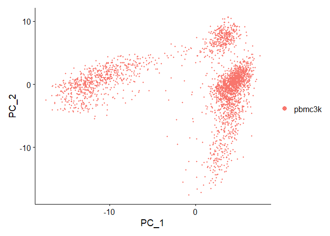
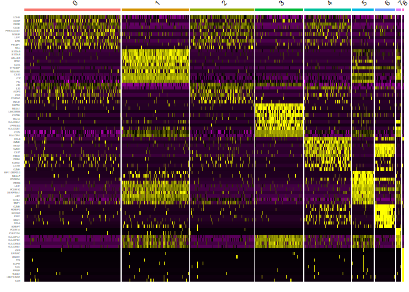

Original Guide:
<https://satijalab.org/seurat/articles/pbmc3k_tutorial.html>

``` r
library(dplyr)
```

    ## 
    ## Attaching package: 'dplyr'

    ## The following objects are masked from 'package:stats':
    ## 
    ##     filter, lag

    ## The following objects are masked from 'package:base':
    ## 
    ##     intersect, setdiff, setequal, union

``` r
library(Seurat)
```

    ## Attaching SeuratObject

``` r
library(patchwork)
library(ggplot2)
```

# Download the rawdata here

<https://s3-us-west-2.amazonaws.com/10x.files/samples/cell/pbmc3k/pbmc3k_filtered_gene_bc_matrices>

``` r
# Load the PBMC dataset
pbmc.data <- Read10X(data.dir = "./pbmc3k_filtered_gene_bc_matrices/filtered_gene_bc_matrices/hg19")
# Initialize the Seurat object with the raw (non-normalized data).

pbmc <- CreateSeuratObject(counts = pbmc.data, project = "pbmc3k", min.cells = 3, min.features = 200)
```

    ## Warning: Feature names cannot have underscores ('_'), replacing with dashes
    ## ('-')

``` r
pbmc
```

    ## An object of class Seurat 
    ## 13714 features across 2700 samples within 1 assay 
    ## Active assay: RNA (13714 features, 0 variable features)

``` r
# The [[ operator can add columns to object metadata. This is a great place to stash QC stats
pbmc[["percent.mt"]] <- PercentageFeatureSet(pbmc, pattern = "^MT-")

# Visualize QC metrics as a violin plot
VlnPlot(pbmc, features = c("nFeature_RNA", "nCount_RNA", "percent.mt"), ncol = 3)
```

<!-- -->

``` r
# FeatureScatter is typically used to visualize feature-feature relationships, but can be used
# for anything calculated by the object, i.e. columns in object metadata, PC scores etc.

plot1 <- FeatureScatter(pbmc, feature1 = "nCount_RNA", feature2 = "percent.mt")
plot2 <- FeatureScatter(pbmc, feature1 = "nCount_RNA", feature2 = "nFeature_RNA")
plot1 + plot2
```

<!-- --> VST function
calculates a variance stabilizing transformation (VST) from the fitted
dispersion-mean relation(s) and then transforms the count data
(normalized by division by the size factors or normalization factors),
yielding a matrix of values which are now approximately homoskedastic
(having constant variance along the range of mean values). The
transformation also normalizes with respect to library size. The rlog is
less sensitive to size factors, which can be an issue when size factors
vary widely. These transformations are useful when checking for outliers
or as input for machine learning techniques such as clustering or linear
discriminant analysis.

``` r
pbmc <- NormalizeData(pbmc, normalization.method = "LogNormalize")

pbmc <- FindVariableFeatures(pbmc, selection.method = "vst", nfeatures = 2000)
#https://rdrr.io/bioc/DESeq2/man/varianceStabilizingTransformation.html
```

``` r
# Identify the 10 most highly variable genes
top10 <- head(VariableFeatures(pbmc), 10)
top10
```

    ##  [1] "PPBP"   "S100A9" "IGLL5"  "LYZ"    "GNLY"   "FTL"    "PF4"    "FTH1"  
    ##  [9] "FCER1A" "GNG11"

``` r
# plot variable features with and without labels
plot1 <- VariableFeaturePlot(pbmc)
plot2 <- LabelPoints(plot = plot1, points = top10, repel = TRUE)
```

    ## When using repel, set xnudge and ynudge to 0 for optimal results

``` r
plot1
```

<!-- -->

``` r
plot2
```

<!-- -->

``` r
all.genes <- rownames(pbmc)
pbmc <- ScaleData(pbmc, features = all.genes)
```

    ## Centering and scaling data matrix

``` r
pbmc <- RunPCA(pbmc, features = VariableFeatures(object = pbmc))
```

    ## PC_ 1 
    ## Positive:  MALAT1, LTB, IL32, CD2, ACAP1, STK17A, CTSW, CD247, CCL5, GIMAP5 
    ##     AQP3, GZMA, CST7, TRAF3IP3, MAL, HOPX, ITM2A, GZMK, MYC, BEX2 
    ##     GIMAP7, ETS1, LDLRAP1, ZAP70, LYAR, RIC3, TNFAIP8, KLRG1, SAMD3, NKG7 
    ## Negative:  CST3, TYROBP, LST1, AIF1, FTL, FCN1, LYZ, FTH1, S100A9, FCER1G 
    ##     TYMP, CFD, LGALS1, CTSS, S100A8, SERPINA1, LGALS2, SPI1, IFITM3, PSAP 
    ##     CFP, SAT1, IFI30, COTL1, S100A11, NPC2, LGALS3, GSTP1, PYCARD, NCF2 
    ## PC_ 2 
    ## Positive:  CD79A, MS4A1, TCL1A, HLA-DQA1, HLA-DRA, HLA-DQB1, LINC00926, CD79B, HLA-DRB1, CD74 
    ##     HLA-DPB1, HLA-DMA, HLA-DQA2, HLA-DRB5, HLA-DPA1, HLA-DMB, FCRLA, HVCN1, LTB, BLNK 
    ##     KIAA0125, P2RX5, IRF8, IGLL5, SWAP70, ARHGAP24, SMIM14, PPP1R14A, FCRL2, C16orf74 
    ## Negative:  NKG7, PRF1, CST7, GZMA, GZMB, FGFBP2, CTSW, GNLY, GZMH, SPON2 
    ##     CCL4, FCGR3A, CCL5, CD247, XCL2, CLIC3, AKR1C3, SRGN, HOPX, CTSC 
    ##     TTC38, S100A4, ANXA1, IL32, IGFBP7, ID2, ACTB, XCL1, APOBEC3G, SAMD3 
    ## PC_ 3 
    ## Positive:  HLA-DQA1, CD79A, CD79B, HLA-DQB1, HLA-DPB1, CD74, HLA-DPA1, MS4A1, HLA-DRB1, HLA-DRB5 
    ##     HLA-DRA, HLA-DQA2, TCL1A, LINC00926, HLA-DMB, HLA-DMA, HVCN1, FCRLA, IRF8, BLNK 
    ##     KIAA0125, SMIM14, PLD4, IGLL5, P2RX5, TMSB10, SWAP70, LAT2, MALAT1, IGJ 
    ## Negative:  PPBP, PF4, SDPR, SPARC, GNG11, NRGN, GP9, RGS18, TUBB1, CLU 
    ##     HIST1H2AC, AP001189.4, ITGA2B, CD9, TMEM40, CA2, PTCRA, ACRBP, MMD, TREML1 
    ##     NGFRAP1, F13A1, RUFY1, SEPT5, MPP1, CMTM5, TSC22D1, MYL9, RP11-367G6.3, GP1BA 
    ## PC_ 4 
    ## Positive:  HLA-DQA1, CD79A, CD79B, HIST1H2AC, HLA-DQB1, PF4, MS4A1, SDPR, CD74, PPBP 
    ##     HLA-DPB1, GNG11, HLA-DQA2, SPARC, HLA-DRB1, HLA-DPA1, GP9, TCL1A, HLA-DRA, LINC00926 
    ##     NRGN, RGS18, HLA-DRB5, PTCRA, CD9, AP001189.4, CA2, CLU, TUBB1, ITGA2B 
    ## Negative:  VIM, S100A8, S100A6, S100A4, S100A9, TMSB10, IL32, GIMAP7, LGALS2, S100A10 
    ##     RBP7, FCN1, MAL, LYZ, S100A12, MS4A6A, CD2, FYB, S100A11, FOLR3 
    ##     GIMAP4, AQP3, ANXA1, AIF1, MALAT1, GIMAP5, IL8, IFI6, TRABD2A, TMSB4X 
    ## PC_ 5 
    ## Positive:  GZMB, FGFBP2, NKG7, GNLY, PRF1, CCL4, CST7, SPON2, GZMA, CLIC3 
    ##     GZMH, XCL2, CTSW, TTC38, AKR1C3, CCL5, IGFBP7, XCL1, CCL3, S100A8 
    ##     TYROBP, HOPX, CD160, HAVCR2, S100A9, FCER1G, PTGDR, LGALS2, RBP7, S100A12 
    ## Negative:  LTB, VIM, AQP3, PPA1, MAL, KIAA0101, CD2, CYTIP, CORO1B, FYB 
    ##     IL32, TRADD, ANXA5, TUBA1B, HN1, TYMS, PTGES3, ITM2A, COTL1, GPR183 
    ##     TNFAIP8, ACTG1, TRAF3IP3, ATP5C1, GIMAP4, ZWINT, PRDX1, LDLRAP1, ABRACL, NGFRAP1

``` r
# Examine and visualize PCA results a few different ways
print(pbmc[["pca"]], dims = 1:2, nfeatures = 5)
```

    ## PC_ 1 
    ## Positive:  MALAT1, LTB, IL32, CD2, ACAP1 
    ## Negative:  CST3, TYROBP, LST1, AIF1, FTL 
    ## PC_ 2 
    ## Positive:  CD79A, MS4A1, TCL1A, HLA-DQA1, HLA-DRA 
    ## Negative:  NKG7, PRF1, CST7, GZMA, GZMB

``` r
VizDimLoadings(pbmc, dims = 1:2, nfeatures = 15, reduction = "pca")
```

<!-- -->

``` r
DimPlot(pbmc, reduction = "pca")
```

<!-- -->

``` r
DimHeatmap(pbmc, dims = 1, cells = 500, balanced = TRUE)
```

<!-- -->
<https://www.rdocumentation.org/packages/jackstraw/versions/1.3/topics/jackstraw>

Test for association between the observed data and their systematic
patterns of variations. Systematic patterns may be captured by latent
variables using principal component analysis (PCA), factor analysis
(FA), and related methods. The jackstraw enables statistical testing for
association between observed variables and latent variables, as captured
by PCs or other estimates.

``` r
# NOTE: This process can take a long time for big datasets, comment out for expediency. More
# approximate techniques such as those implemented in ElbowPlot() can be used to reduce
# computation time
pbmc <- JackStraw(pbmc, num.replicate = 100)
pbmc <- ScoreJackStraw(pbmc, dims = 1:20)

JackStrawPlot(pbmc, dims = 1:15)
```

    ## Warning: Removed 23300 rows containing missing values (geom_point).

<!-- -->

``` r
ElbowPlot(pbmc)
```

<!-- -->

We chose 10 here, but encourage users to consider the following:

Dendritic cell and NK aficionados may recognize that genes strongly
associated with PCs 12 and 13 define rare immune subsets (i.e. MZB1 is a
marker for plasmacytoid DCs). However, these groups are so rare, they
are difficult to distinguish from background noise for a dataset of this
size without prior knowledge . We encourage users to repeat downstream
analyses with a different number of PCs (10, 15, or even 50!). As you
will observe, the results often do not differ dramatically.

We advise users to err on the higher side when choosing this parameter.
For example, performing downstream analyses with only 5 PCs does
significantly and adversely affect results.

``` r
pbmc <- FindNeighbors(pbmc, dims = 1:10)
```

    ## Computing nearest neighbor graph

    ## Computing SNN

``` r
pbmc <- FindClusters(pbmc, resolution = 0.5)
```

    ## Modularity Optimizer version 1.3.0 by Ludo Waltman and Nees Jan van Eck
    ## 
    ## Number of nodes: 2700
    ## Number of edges: 97892
    ## 
    ## Running Louvain algorithm...
    ## Maximum modularity in 10 random starts: 0.8719
    ## Number of communities: 9
    ## Elapsed time: 0 seconds

``` r
# Look at cluster IDs of the first 5 cells
head(Idents(pbmc), 5)
```

    ## AAACATACAACCAC-1 AAACATTGAGCTAC-1 AAACATTGATCAGC-1 AAACCGTGCTTCCG-1 
    ##                0                3                2                5 
    ## AAACCGTGTATGCG-1 
    ##                6 
    ## Levels: 0 1 2 3 4 5 6 7 8

``` r
pbmc <- RunUMAP(pbmc, dims = 1:10)
```

    ## Warning: The default method for RunUMAP has changed from calling Python UMAP via reticulate to the R-native UWOT using the cosine metric
    ## To use Python UMAP via reticulate, set umap.method to 'umap-learn' and metric to 'correlation'
    ## This message will be shown once per session

    ## 09:54:12 UMAP embedding parameters a = 0.9922 b = 1.112

    ## 09:54:12 Read 2700 rows and found 10 numeric columns

    ## 09:54:12 Using Annoy for neighbor search, n_neighbors = 30

    ## 09:54:12 Building Annoy index with metric = cosine, n_trees = 50

    ## 0%   10   20   30   40   50   60   70   80   90   100%

    ## [----|----|----|----|----|----|----|----|----|----|

    ## **************************************************|
    ## 09:54:13 Writing NN index file to temp file C:\Users\harpa\AppData\Local\Temp\RtmpoJsBmG\file2fb877d171ce
    ## 09:54:13 Searching Annoy index using 1 thread, search_k = 3000
    ## 09:54:14 Annoy recall = 100%
    ## 09:54:14 Commencing smooth kNN distance calibration using 1 thread
    ## 09:54:15 Initializing from normalized Laplacian + noise
    ## 09:54:15 Commencing optimization for 500 epochs, with 107868 positive edges
    ## 09:54:23 Optimization finished

``` r
DimPlot(pbmc, reduction = "umap")
```

<!-- -->

``` r
# find all markers of cluster 1
cluster1.markers <- FindMarkers(pbmc, ident.1 = 1, min.pct = 0.25)
head(cluster1.markers, n = 5)
```

    ##                p_val avg_log2FC pct.1 pct.2     p_val_adj
    ## S100A9  0.000000e+00   5.504171 0.994 0.215  0.000000e+00
    ## S100A8  0.000000e+00   5.466239 0.967 0.121  0.000000e+00
    ## FCN1    0.000000e+00   3.432922 0.953 0.147  0.000000e+00
    ## LGALS2  0.000000e+00   3.717131 0.900 0.059  0.000000e+00
    ## CD14   4.401366e-294   2.805663 0.660 0.029 6.036033e-290

``` r
VlnPlot(pbmc, features = c(row.names(cluster1.markers)[1], row.names(cluster1.markers)[2]))
```

<!-- -->

``` r
# find all markers of cluster 2
cluster2.markers <- FindMarkers(pbmc, ident.1 = 2, min.pct = 0.25)
head(cluster2.markers, n = 5)
```

    ##             p_val avg_log2FC pct.1 pct.2    p_val_adj
    ## LTB  1.612441e-82   1.184609 0.983 0.642 2.211301e-78
    ## IL32 1.159398e-77   1.041183 0.944 0.472 1.589998e-73
    ## LDHB 3.451452e-74   1.015630 0.972 0.607 4.733321e-70
    ## CD3D 1.368338e-65   0.882007 0.914 0.438 1.876539e-61
    ## IL7R 5.971448e-58   1.098859 0.732 0.333 8.189244e-54

``` r
VlnPlot(pbmc, features = c(row.names(cluster2.markers)[1], row.names(cluster2.markers)[2]))
```

<!-- -->

``` r
# find all markers distinguishing cluster 5 from clusters 0 and 3
cluster5.markers <- FindMarkers(pbmc, ident.1 = 5, ident.2 = c(0, 3), min.pct = 0.25)
head(cluster5.markers, n = 5)
```

    ##                       p_val avg_log2FC pct.1 pct.2     p_val_adj
    ## FCGR3A        1.448731e-208   4.295367 0.975 0.037 1.986790e-204
    ## CFD           2.362385e-199   3.478465 0.937 0.033 3.239775e-195
    ## IFITM3        4.090907e-199   3.886400 0.975 0.045 5.610270e-195
    ## RP11-290F20.3 1.025050e-189   2.741460 0.849 0.017 1.405753e-185
    ## CD68          4.386481e-188   2.998564 0.906 0.033 6.015620e-184

``` r
VlnPlot(pbmc, features = c(row.names(cluster5.markers)[1], row.names(cluster5.markers)[2]))
```

<!-- -->

``` r
# find markers for every cluster compared to all remaining cells, report only the positive ones
pbmc.markers <- FindAllMarkers(pbmc, only.pos = TRUE, min.pct = 0.25, logfc.threshold = 0.25)
```

    ## Calculating cluster 0

    ## Calculating cluster 1

    ## Calculating cluster 2

    ## Calculating cluster 3

    ## Calculating cluster 4

    ## Calculating cluster 5

    ## Calculating cluster 6

    ## Calculating cluster 7

    ## Calculating cluster 8

``` r
x <- pbmc.markers %>% group_by(cluster) %>% top_n(n = 1, wt = avg_log2FC)
FeaturePlot(pbmc, features = x$gene[1:4])
```

<!-- -->

``` r
FeaturePlot(pbmc, features = x$gene[5:8])
```

<!-- -->

``` r
p <- FeaturePlot(pbmc, features = c("MS4A1", "GNLY", "CD3E", "CD14", "FCER1A", "FCGR3A", "LYZ", "PPBP", "CD8A"), combine = FALSE)

p <- lapply(X = p, FUN = function(x) x + 
                                        theme(plot.title = element_text(size = 8)) +
                                        theme(axis.title.y = element_text(size = 5)) +
                                        theme(axis.title.x = element_text(size = 5)) +
                                        theme(axis.text.y = element_text(size = 5)) +
                                        theme(axis.text.x = element_text(size = 5)) +
                                        theme(legend.position = "none")  )

CombinePlots(plots = p)
```

    ## Warning: CombinePlots is being deprecated. Plots should now be combined using
    ## the patchwork system.

<!-- -->

``` r
top10 <- pbmc.markers %>% 
            group_by(cluster) %>% 
            top_n(n = 10, wt = avg_log2FC)

top10
```

    ## Registered S3 method overwritten by 'cli':
    ##   method     from         
    ##   print.boxx spatstat.geom

    ## # A tibble: 90 x 7
    ## # Groups:   cluster [9]
    ##        p_val avg_log2FC pct.1 pct.2 p_val_adj cluster gene     
    ##        <dbl>      <dbl> <dbl> <dbl>     <dbl> <fct>   <chr>    
    ##  1 3.04e-104      0.999 0.895 0.592 4.16e-100 0       LDHB     
    ##  2 1.10e- 81      1.33  0.432 0.111 1.51e- 77 0       CCR7     
    ##  3 4.20e- 79      0.965 0.848 0.407 5.75e- 75 0       CD3D     
    ##  4 5.53e- 49      0.815 0.71  0.402 7.59e- 45 0       CD3E     
    ##  5 2.53e- 48      1.08  0.336 0.108 3.46e- 44 0       PRKCQ-AS1
    ##  6 1.40e- 47      0.958 0.625 0.358 1.91e- 43 0       NOSIP    
    ##  7 3.99e- 41      0.974 0.316 0.109 5.47e- 37 0       LEF1     
    ##  8 6.44e- 41      0.786 0.611 0.329 8.83e- 37 0       IL7R     
    ##  9 5.75e- 37      0.852 0.42  0.188 7.89e- 33 0       PIK3IP1  
    ## 10 3.67e- 32      0.908 0.259 0.087 5.03e- 28 0       MAL      
    ## # ... with 80 more rows

``` r
p2 <- DoHeatmap(pbmc, features = top10$gene, group.bar.height = 0.01,size=3,combine = FALSE) 

p2 <- lapply(X = p2, FUN = function(x) x + 
                                        theme(plot.title = element_text(size = 8)) +
                                        theme(axis.title.y = element_text(size = 5)) +
                                        theme(axis.title.x = element_text(size = 5)) +
                                        theme(axis.text.y = element_text(size = 3)) +
                                        theme(legend.position = "none")  )

CombinePlots(plots = p2)
```

    ## Warning: CombinePlots is being deprecated. Plots should now be combined using
    ## the patchwork system.

<!-- -->

# Assigning cell type identity to clusters

``` r
new.cluster.ids <- c("Naive CD4 T", "Memory CD4 T", "CD14+ Mono", "B", "CD8 T", "FCGR3A+ Mono", "NK", "DC", "Platelet")
names(new.cluster.ids) <- levels(pbmc)

pbmc <- RenameIdents(pbmc, new.cluster.ids)
DimPlot(pbmc, reduction = "pca", label = TRUE, pt.size = 0.5)
```

<!-- -->

``` r
pbmc
```

    ## An object of class Seurat 
    ## 13714 features across 2700 samples within 1 assay 
    ## Active assay: RNA (13714 features, 2000 variable features)
    ##  2 dimensional reductions calculated: pca, umap

``` r
DimPlot(pbmc, reduction = "umap", label = TRUE, pt.size = 0.5)
```

<!-- -->

``` r
sessionInfo()
```

    ## R version 4.1.0 (2021-05-18)
    ## Platform: x86_64-w64-mingw32/x64 (64-bit)
    ## Running under: Windows 10 x64 (build 19043)
    ## 
    ## Matrix products: default
    ## 
    ## locale:
    ## [1] LC_COLLATE=English_Malaysia.1252  LC_CTYPE=English_Malaysia.1252   
    ## [3] LC_MONETARY=English_Malaysia.1252 LC_NUMERIC=C                     
    ## [5] LC_TIME=English_Malaysia.1252    
    ## 
    ## attached base packages:
    ## [1] stats     graphics  grDevices utils     datasets  methods   base     
    ## 
    ## other attached packages:
    ## [1] ggplot2_3.3.5      patchwork_1.1.1    SeuratObject_4.0.2 Seurat_4.0.3      
    ## [5] dplyr_1.0.7       
    ## 
    ## loaded via a namespace (and not attached):
    ##   [1] Rtsne_0.15            colorspace_2.0-1      deldir_0.2-10        
    ##   [4] ellipsis_0.3.2        ggridges_0.5.3        rstudioapi_0.13      
    ##   [7] spatstat.data_2.1-0   leiden_0.3.8          listenv_0.8.0        
    ##  [10] farver_2.1.0          ggrepel_0.9.1         RSpectra_0.16-0      
    ##  [13] fansi_0.5.0           codetools_0.2-18      splines_4.1.0        
    ##  [16] knitr_1.33            polyclip_1.10-0       jsonlite_1.7.2       
    ##  [19] ica_1.0-2             cluster_2.1.2         png_0.1-7            
    ##  [22] uwot_0.1.10           shiny_1.6.0           sctransform_0.3.2    
    ##  [25] spatstat.sparse_2.0-0 compiler_4.1.0        httr_1.4.2           
    ##  [28] assertthat_0.2.1      Matrix_1.3-3          fastmap_1.1.0        
    ##  [31] lazyeval_0.2.2        limma_3.48.1          cli_2.5.0            
    ##  [34] later_1.2.0           htmltools_0.5.1.1     tools_4.1.0          
    ##  [37] igraph_1.2.6          gtable_0.3.0          glue_1.4.2           
    ##  [40] RANN_2.6.1            reshape2_1.4.4        Rcpp_1.0.6           
    ##  [43] scattermore_0.7       vctrs_0.3.8           nlme_3.1-152         
    ##  [46] lmtest_0.9-38         xfun_0.23             stringr_1.4.0        
    ##  [49] globals_0.14.0        mime_0.11             miniUI_0.1.1.1       
    ##  [52] lifecycle_1.0.0       irlba_2.3.3           goftest_1.2-2        
    ##  [55] future_1.21.0         MASS_7.3-54           zoo_1.8-9            
    ##  [58] scales_1.1.1          spatstat.core_2.2-0   promises_1.2.0.1     
    ##  [61] spatstat.utils_2.2-0  parallel_4.1.0        RColorBrewer_1.1-2   
    ##  [64] yaml_2.2.1            reticulate_1.20       pbapply_1.4-3        
    ##  [67] gridExtra_2.3         rpart_4.1-15          stringi_1.6.1        
    ##  [70] highr_0.9             rlang_0.4.11          pkgconfig_2.0.3      
    ##  [73] matrixStats_0.59.0    evaluate_0.14         lattice_0.20-44      
    ##  [76] ROCR_1.0-11           purrr_0.3.4           tensor_1.5           
    ##  [79] htmlwidgets_1.5.3     labeling_0.4.2        cowplot_1.1.1        
    ##  [82] tidyselect_1.1.1      parallelly_1.26.0     RcppAnnoy_0.0.18     
    ##  [85] plyr_1.8.6            magrittr_2.0.1        R6_2.5.0             
    ##  [88] generics_0.1.0        DBI_1.1.1             pillar_1.6.1         
    ##  [91] withr_2.4.2           mgcv_1.8-35           fitdistrplus_1.1-5   
    ##  [94] survival_3.2-11       abind_1.4-5           tibble_3.1.2         
    ##  [97] future.apply_1.7.0    crayon_1.4.1          KernSmooth_2.23-20   
    ## [100] utf8_1.2.1            spatstat.geom_2.2-0   plotly_4.9.4.1       
    ## [103] rmarkdown_2.9         grid_4.1.0            data.table_1.14.0    
    ## [106] digest_0.6.27         xtable_1.8-4          tidyr_1.1.3          
    ## [109] httpuv_1.6.1          munsell_0.5.0         viridisLite_0.4.0
